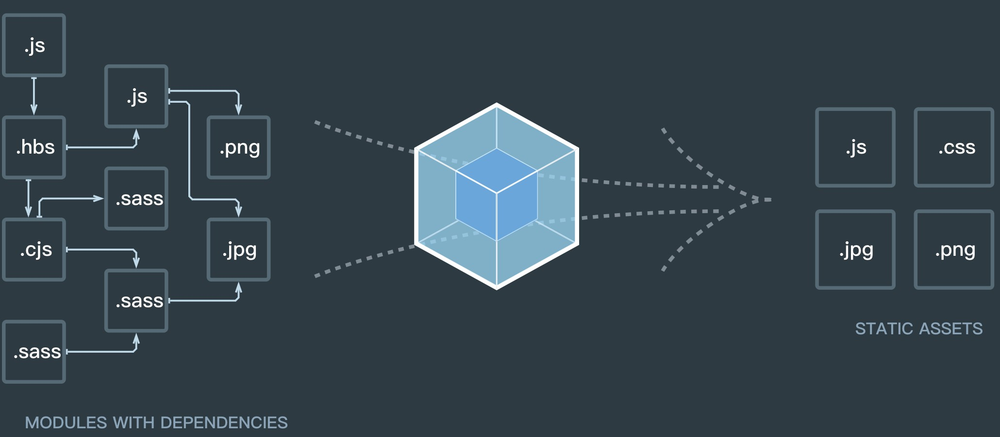

------
title: webpack入门
categories: JavaScript
date: 2018-1-28 23:58
tags: webpack

------

### 背景

ES6 的模块系统: import 和export

```JavaScript
export default custom = {
    // 对象
}
/*****************/
import custom from '.....'
```

Common.js

```JavaScript
let { stat, exists, readFile } = require('fs');

// 等同于
let fs = require('fs');
let stat = fs.stat;
let exists = fs.exists;
let readfile = fs.readfile;
```

没有模块加载和打包工具前,需要要么手工合并文件，要么使用一堆`<script>`标签,带来一些问题

- 必须保证文件加载的顺序没错，包括知道哪些文件依赖另外一些文件，以及不包含不需要的文件。
- 多个`<script>`标签意味着对服务器发送多次请求，性能会受影响。

模块文件使用很方便,通过npm安装相应插件模块,直接import引入即可

###  1.概念

webpack 是一个现代 JavaScript 应用程序的**静态模块打包器**(module bundler)。当 webpack 处理应用程序时，它会递归地构建一个依赖关系图(dependency graph)，其中包含应用程序需要的每个模块，然后将所有这些模块打包成一个或多个 bundle。



认识webpack,需了解四个核心概念:

- 入口(entry)
- 输出(output)
- loader
- 插件(plugins)

####  1.1 [入口(entry )](https://doc.webpack-china.org/concepts/entry-points)

入口起点指示 webpack 应该使用哪个模块，来作为构建其内部*依赖图*的开始。

每个依赖项随即被处理，最后**输出到称之为 bundles 的文件**中

> 可以通过在 webpack 配置中配置 entry 属性，来指定一个入口起点（或多个入口起点）

```JavaScript
module.exports = {
  entry: './index.js'
};
```

当工程是多页面应用程序:

```JavaScript
const config = {
  entry: {
    pageOne: './src/pageOne/index.js',
    pageTwo: './src/pageTwo/index.js',
    pageThree: './src/pageThree/index.js'
  }
};
```

####  1.2 [出口(output)](https://doc.webpack-china.org/concepts/output)

`output`属性指在哪里输出它所创建的 *bundles*，包括以下两点：

- `filename` 用于输出文件的文件名。
-  `path`指输出 的绝对路径。

```output```  属性告诉 webpack 在**哪里(path)输出它所创建的 bundles**，以及如何命名这些文件。

```JavaScript
const path = require('path');
module.exports = {
  entry: './file.js',
  output: {
    path: path.resolve(__dirname, 'dist'),
    filename: '[name].bundle.js',            //输出的文件名将为file.bundle.js,在当前文件夹dist目录下
    publicPath: '/dist/'
  }
};
```

> ```output.filename``` 决定了每个输出 bundle 的名称

| 模板          | 描述                             |
| ----------- | ------------------------------ |
| [hash]      | 模块标识符(module identifier)的 hash |
| [chunkhash] | chunk 内容的 hash                 |
| [name]      | 模块名称                           |
| [id]        | 模块标识符(module identifier)       |
| [query]     | 模块的 query，例如，文件名 `?` 后面的字符串    |

#### 1.3 [loader](https://doc.webpack-china.org/concepts/loaders)

*loader* 让 webpack 能够去处理那些非 JavaScript 文件（webpack 自身只理解 JavaScript）。loader 可以将所有类型的文件转换为 webpack 能够处理的有效[模块](https://doc.webpack-china.org/concepts/modules).

> 本质: webpack loader 将所有类型的文件，转换为应用程序的依赖图可以直接引用的模块。

 webpack 的配置中 **loader** 有两个属性:

-  `test` :识别出应该被对应的 loader 进行转换的那些文件;
- `use`:转换这些文件，从而使其能够被添加到依赖图中（并且最终添加到 bundle 中）

当编译时碰到 `require()`/`import` 语句中被解析为路径时,打包前将执行loader进行转换

```JavaScript
const path = require('path');
module.exports = {
  entry: './path/to/my/entry/file.js',
  output: {
    path: path.resolve(__dirname, 'dist'),
    filename: 'my-first-webpack.bundle.js'
  },
  module: {
    rules: [
      { test: /\.css$/, use: 'css-loader' }
    ]
  }
};
```

####  1.4 [插件(plugins)](https://doc.webpack-china.org/concepts/plugins/)

插件的执行范围比较广,包括从打包优化和压缩,一直到重新定义环境中的变量

- 使用步骤：先require（），再添加到plugins数组中
- tips：
  - ①多数插件可以通过选项options自定义
  - ②多次使用同一个插件时，可以通过new 创建实例

```JavaScript
const HtmlWebpackPlugin = require('html-webpack-plugin'); // 通过 npm 安装
const webpack = require('webpack'); // 用于访问内置插件
const path = require('path');
module.exports = {
  entry: './file.js',
  output: {
    path: path.resolve(__dirname, 'dist'),
    filename: '[name].bundle.js'
  },
  module: {
    rules: [
      { test: /\.css$/, use: 'css-loader' }
    ]
  },
  plugins: [
    new webpack.optimize.UglifyJsPlugin(),
    new HtmlWebpackPlugin({template: './src/index.html'}) //使用html模板
  ]
};
```

#### 1.5 配置(Configuration)

 webpack 的配置文件，是导出一个对象的 JavaScript 文件(module.exports)

webpack 配置是标准的 ```Node.js CommonJS``` 模块:

- 通过 `require(...)` 导入其他文件
- 通过 `require(...)` 使用 npm 的工具函数
- 使用 JavaScript 控制流表达式，例如 `?:` 操作符
- 对常用值使用常量或变量
- 编写并执行函数来生成部分配置

导出多个配置对象

```JavaScript
module.exports = [{
  output: {
    filename: './dist-amd.js',
    libraryTarget: 'amd'
  },
  entry: './app.js',
}, {
  output: {
    filename: './dist-commonjs.js',
    libraryTarget: 'commonjs'
  },
  entry: './app.js',
}]
```

####  1.6 模块(Modules)

对比 Node.js 模块，webpack 模块能够以各种方式表达它们的依赖关系,如:

- ES2015 import 语句
- CommonJS require() 语句
- AMD define 和 require 语句
- css/sass/less 文件中的 @import 语句。
- 样式(url(...))或 HTML 文件()中的图片链接(image url)

> webpack 通过 *loader* 可以支持各种语言和预处理器编写模块。

####  1.7 模块解析(Module Resolution)

一个模块可以作为另一个模块的依赖模块，然后被后者引用

```JavaScript
import foo from 'path/to/module'
// 或者
require('path/to/module')
```

####  1.8 构建目标(Targets)

多个 Target:

```JavaScript
var path = require('path');
var serverConfig = {
  target: 'node',
  output: {
    path: path.resolve(__dirname, 'dist'),
    filename: 'lib.node.js'
  }
  //…
};
var clientConfig = {
  target: 'web', // <=== 默认是 'web'，可省略
  output: {
    path: path.resolve(__dirname, 'dist'),
    filename: 'lib.js'
  }
  //…
};
module.exports = [ serverConfig, clientConfig ];
//将在dist 文件夹下创建 lib.js 和 lib.node.js 文件。
```

####  1.9 Manifest

- runtime:在模块交互时，连接模块所需的加载和解析逻辑
- manifest:当编译器(compiler)开始执行、解析和映射应用程序时，保留的所有模块详细要点的数据集合

> 通过使用 manifest 中的数据，runtime 将能够查询模块标识符，检索出背后对应的模块。

####  1.10 [模块热替换(Hot Module Replacement)](https://doc.webpack-china.org/concepts/hot-module-replacement/)

在应用程序运行过程中替换、添加或删除模块，而无需重新加载整个页面

- 保留在完全重新加载页面时丢失的应用程序状态。
- 只更新变更内容，以节省宝贵的开发时间。
- 调整样式更加快速 - 几乎相当于在浏览器调试器中更改样式。

###  2.安装

```JavaScript
npm install --save-dev webpack
npm install --save-dev webpack@<version>
```

###  3.[配置](https://doc.webpack-china.org/configuration/)

在webpack.config.js文件中进行配置

```JavaScript
const path = require('path');
const HtmlWebpackPlugin = require('html-webpack-plugin');
const CleanWebpackPlugin = require('clean-webpack-plugin');

module.exports = {
  entry: {   // string | object | array
    app: './src/index.js',
    print: './src/print.js'
  },
  output: { 		// webpack 如何输出结果的相关选项, 必须是绝对路径
    filename: '[name].bundle.js',//文件名模板	
    path: path.resolve(__dirname, 'dist'),
    publicPath: '/' 	 // 输出解析文件的目录，url 相对于 HTML 页面
  },
  devtool: 'inline-source-map',//追踪到错误和警告在源代码中的原始位置
  devServer: {  //提供了一个简单的 web 服务器，并且能够实时重新加载(live reloading)
    contentBase: path.join(__dirname, "./dist"),  //服务器的位置
    port: 3000
  },
  plugins: [
    new CleanWebpackPlugin(['dist']),//每次build都会清理dist文件夹
    new HtmlWebpackPlugin({  //指定模板输出,自动生成新的index,所有的bundle 会自动添加到 html 中
      filename: 'index.html',
      template: 'src/assets/test.html'//模板文件路径
    })
  ],
  module: {				//加载对应资源
      rules: [
        {
          test: /\.css$/,
          use: [
            'style-loader',
            'css-loader'
          ]
        },
        {
          test: /\.(png|svg|jpg|gif)$/,
          use: [
            'file-loader'
          ]
        },
        {
          test: /\.(woff|woff2|eot|ttf|otf)$/,
          use: [
            'file-loader'
          ]
        },
       {
         test: /\.(csv|tsv)$/,
         use: [
           'csv-loader'
         ]
       },
       {
         test: /\.xml$/,
         use: [
           'xml-loader'
         ]
       }
      ]
    }
  

};
```

#### loader

- PostCSS

[PostCSS](https://github.com/postcss/postcss)是一个利用JS插件来对CSS进行转换的工具，这些插件非常强大，强大到无所不能。其中，[Autoprefixer](https://github.com/postcss/autoprefixer)就是众多PostCSS插件中最流行的一个。

安装方法:

`npm i --save-dev postcss`

一般postcss会结合autoprefixer一起使用,autoprefixer是css的后处理器,可为css添加浏览器前缀,使兼容不同浏览器,安装方法:

`npm install --save-dev autoprefixer`

**配置1:**

```JavaScript
 {
    test: /\.less$/,
    exclude: /node_modules/,
		use: ExtractTextPlugin.extract({fallback: "style-loader",use: 'css-loader!postcss-loader!less-loader'})
 }
/*可以处理less或sass*/
```

这种方式需要在项目根目录下添加`psotcss-config.js`文件,里面添加

```JavaScript
module.exports = {  
  plugins: [  
      require('autoprefixer')({browsers: ['last 5 versions']})  
  ]  
}  
```

**配置2:**

```JavaScript
{
  test: /\.less$/,
  exclude: /node_modules/,
  use: ExtractTextPlugin.extract({
    fallback: "style-loader",
    use: [
      {loader: 'css-loader'}, 
      {loader: 'postcss-loader',
       options: {plugins: [require('autoprefixer')({browsers: ['last 5 versions']})
       ]}
      },
      {loader: 'less-loader'}]
  )}
}
```

这种配置是将postcss配置依赖直接放在里面了

- babel

安装`npm install --save-dev babel-loader babel-core`

安装: `npm install babel-preset-env --save-dev`

在根目录下新建`.babelrc` 文件,添加

```JavaScript
{
  "presets": ["env"]
}
```

```JavaScript
{ test: /\.js$/, 
  exclude: /(node_modules|bower_components)/,
    use: {
      loader: 'babel-loader',
        options: {							//
          presets: ["env"]			//如果有.babellrc文件这个配置可省略
        }												//
    }
},
```

###  4.环境构建

####  4.1 配置

- 开发环境(development)：需要具有强大的、具有实时重新加载(live reloading)或热模块替换(hot module replacement)能力的 source map 和 localhost server；
- 生产环境(production)：我们的目标转向于关注更小的 bundle，更轻量的 source map，以及更优化的资源，以改善加载时间；

> 由于要遵循逻辑分离，我们通常建议为每个环境编写**彼此独立的 webpack 配置**，但会保留"通用"配置。

通过工具```webpack-merge``` ,将"通用"配置合并在一起:

```JavaScript
npm install --save-dev webpack-merge
```

**project项目结构**

```JavaScript
webpack-demo
  |- package.json
  |- config
    |- webpack.common.js
    |- webpack.dev.js
    |- webpack.prod.js
  |-src
	|-index.js
  |- index.html
```

**webpack.common.js公共配置**

```JavaScript
const path = require('path');
const HtmlWebpackPlugin = require('html-webpack-plugin');
const CleanWebpackPlugin = require('clean-webpack-plugin');
const webpack = require('webpack');
module.exports = {
  entry: {
    index: path.resolve(__dirname,'../src/index.js'),
  },
  resolve: {
    alias: {  //别名,引入第三方库jQuery之后起的别名
      jquery: path.resolve(__dirname,'../libs/jquery-3.2.1.js')
    }
  },
  plugins: [
    new CleanWebpackPlugin(//清理文件夹
      ['*.js','*.map','*.png','*.css','*.html'],　 //匹配删除的文件,若为*则全部删除
      {
        root: path.resolve(__dirname,'../dist'),
        verbose:  true,  //开启在控制台输出信息
      }),
    new HtmlWebpackPlugin({  //指定模板输出
      filename: 'index.html',
      template: './index.html'
    }),
    new webpack.ProvidePlugin({     //自动生成全局变量,一旦引用,就会打包
      $:"jquery",
      jQuery:"jquery",
      'window.jQuery':"jquery",
      'window.$':"jquery"
    }),
  ],
  module: {
    rules: [
      {
        test: /\.css$/,
        use: ['style-loader', 'css-loader']
      },
      { test: /\.js$/, 
        exclude: /(node_modules|bower_components)/,
        use: {
          loader: 'babel-loader',
          options: {
            presets: ["env"]
          }
        }
      }
    ]
  },  
  output: {   //打包输出配置路径
    filename: '[name]-[hash].bundle.js',
    path: path.resolve(__dirname, '../dist'),
    publicPath: '' //上线的绝对地址 可以为http://www.haohome.top/
  },  
};
```

**webpack.dev.js 开发配置**

```JavaScript
const path = require('path');
const merge = require('webpack-merge');
const common = require('./webpack.common.js');
module.exports = merge(common, {  //与公共配置合并
  devtool: 'inline-source-map',//追踪错误和警告
  devServer: {  //提供了一个简单的 web 服务器，并且能够实时重新加载(live reloading)
    contentBase:path.resolve(__dirname, "../"),  //服务器的位置
  },
});
```

**webpack.prod.js 生产配置**

```JavaScript
const merge = require('webpack-merge');
const UglifyJSPlugin = require('uglifyjs-webpack-plugin');//代码压缩工具
const common = require('./webpack.common.js');
module.exports = merge(common, {
  devtool: 'source-map',	//调试源码(debug)和运行基准测试(benchmark tests)很有用
  plugins: [
    new UglifyJSPlugin({
      sourceMap: true		//如果配置了devtool则加改选项
    })			
  ],
});
/ 避免在生产中使用 inline-*** 和 eval-***，因为它们可以增加 bundle 大小，并降低整体性能。
```

**package.json配置NPM Scripts:** 

把 `scripts` 重新指向到新配置。我们将 `npm start` 定义为*开发环境*脚本，并在其中使用 `webpack-dev-server`，将 `npm run build` 定义为*生产环境*脚本:

```JavaScript
"scripts": {
  "start": "webpack-dev-server --progress --colors --open --config webpack.dev.js",
  "build": "webpack --progress --colors --config webpack.prod.js"
}
```

####  4.2 指定环境

许多 library 将通过与 `process.env.NODE_ENV` 环境变量关联，以决定 library 中应该引用哪些内容。当使用 `process.env.NODE_ENV === 'production'` 时，一些 library 可能针对具体用户的环境进行代码优化，从而删除或添加一些重要代码。

可以使用 webpack 内置的 `DefinePlugin`为所有的依赖定义这个变量

**webpack.prod.js**

```JavaScript
+ const webpack = require('webpack');//引入webpack
  const merge = require('webpack-merge');
  const UglifyJSPlugin = require('uglifyjs-webpack-plugin');
  const common = require('./webpack.common.js');

  module.exports = merge(common, {
    devtool: 'source-map',
    plugins: [
      new UglifyJSPlugin({
        sourceMap: true
      }),
+     new webpack.DefinePlugin({
+       'process.env.NODE_ENV': JSON.stringify('production')//指定为生产环境
+     })
    ]
  })
```


