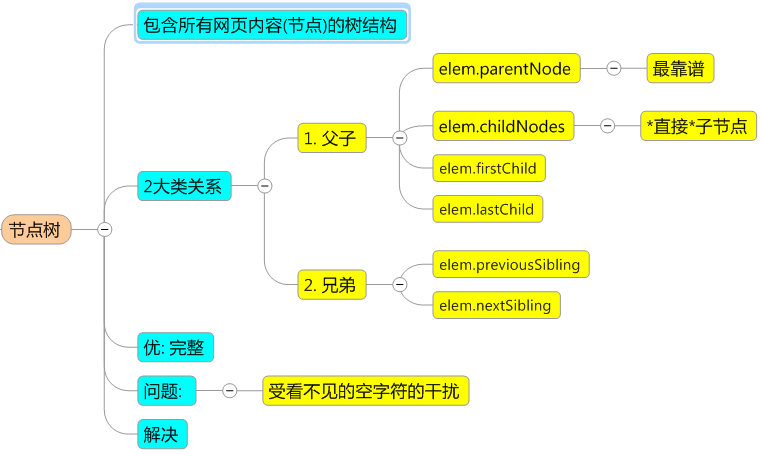
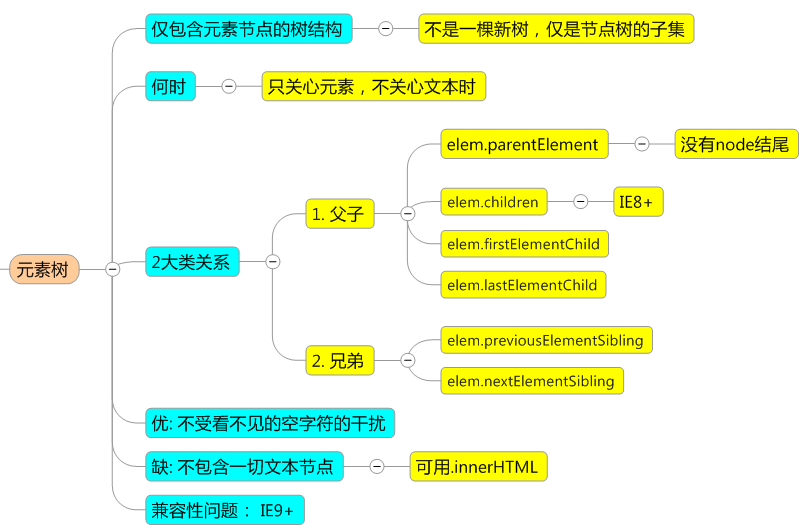

# HTML

#### 1. 浏览器都会开启一个线程来处理这个请求，同时在远程 DNS 服务器上启动一个 DNS 查询。这能使浏览器获得请求对应的 IP 地址。

> - 200 OK      //客户端请求成功
> - 400 Bad Request  //客户端请求有语法错误，不能被服务器所理解
> - 403 Forbidden  //服务器收到请求，但是拒绝提供服务
> - 404 Not Found  //请求资源不存在，输入了错误的URL
> - 500 Internal Server Error //服务器发生不可预期的错误
> - 503 Server Unavailable  //服务器当前不能处理客户端的请求，一段时间后可能恢复正常

#### 2. 一个页面从输入 URL 到页面加载显示完成，这个过程中都发生了什么？

> 1. 浏览器开启一个线程来处理这个请求，同时在远程 DNS 服务器上启动一个 DNS 查询。使浏览器获得请求对应的 IP 地址。
> 2. 浏览器与远程Web服务器通过 TCP 三次握手协商来建立一个 TCP/IP 连接。该握手包括一个同步报文，一个同步-应答报文和一个应答报文，这三个报文在 浏览器和服务器之间传递。该握手首先由客户端尝试建立起通信，而后服务器应答并接受客户端的请求，最后由客户端发出该请求已经被接受的报文。
> 3. 一旦 TCP/IP 连接建立，浏览器会通过该连接向远程服务器发送 HTTP 的 GET 请求。远程服务器找到资源并使用 HTTP 响应返回该资源，值为 200 的 HTTP 响应状态表示一个正确的响应。
> 4. 此时，Web 服务器提供资源服务，客户端开始下载资源。

#### 3. html常见的兼容性问题
- 1、 双边距BUG float引起的  使用display
- 2、 3像素问题 使用float引起的 使用dislpay:inline -3px  
- 3、 超链接hover 点击后失效  使用正确的书写顺序 link visited hover active
- 4、 IE z-index问题 给父级添加position:relative
- 5、 Png 透明 使用js代码 改
- 6、 Min-height 最小高度 ！Important 解决’
- 7、 select 在ie6下遮盖 使用iframe嵌套
- 8、 为什么没有办法定义1px左右的宽度容器（IE6默认的行高造成的，使用over:hidden,zoom:0.08 line-height:1px）
- 9、 IE5-8不支持opacity，解决办法：

```css
.opacity {
    opacity: 0.4
    filter: alpha(opacity=60); /* for IE5-7 */
    -ms-filter: "progid:DXImageTransform.Microsoft.Alpha(Opacity=60)"; /* for IE 8*/
}
```

- 10、 . IE6不支持PNG透明背景，解决办法: IE6下使用gif图片

#### 4.Web Sockets
* HTML5提供的在Web应用程序中客户端与服务器端之间进行的非HTTP的通信机制。使用Web Sockets API可以在服务器与客户端之间建立一个**非HTTP的双向连接**。这个连接是实时的，也是永久的，除非被显示关闭。这意味着当服务器想向客户端发送数据时，可以立即将数据推送到客户端的浏览器中，无须重新建立连接。只要客户端有一个被打开的socket（套接字）并且与服务器建立了连接，服务器就可以把数据推送到这个socket上，服务器不再需要轮询客户端的请求，从被动转为主动。

```JavaScript
  var webSocket = new WebSocket("ws://localhost:8005/socket")
  webSocket.send("data")
  webSocket.addEventListent("message", function(event) {  
        var data = event.data;  
        // 其他处理代码。  
    }, false)
  webSocket.addEventListener("open", function(event) {  
      // 开始通信时的处理。  
   }, false); 
  webSocket.addEventListener("close", function(event) {  
      // 通信结束时的处理。  
  }, false); 
```


# CSS3 

CSS3 笔记基于 [css3-tutorial](https://github.com/waylau/css3-tutorial) 整理得来。

### 1.介绍

* CSS 的三种引入方式

内联方式 Inline Styles: 内联定义即是在对象的标记内使用对象的 style 属性定义适用其的样式表属性。 

```html
<p style="color:#f00">这一行的字体颜色将显示为红色</p>
```
内部样式块对象 Embedding a Style Block: 在 HTML 文档的 `<head>` 标记里插入一个 `<style>` 块对象。 

```css
<style>
  .test2 {
    color: #000;
  }
</style>
```

外部样式表 Linking to a Style Sheet: 先建立外部样式表文件 `*.css`，然后使用 HTML 的 `link` 对象。或者使用 `@import` 来引入。

```html
<!-- Use link elements -->
<link rel="stylesheet" href="core.css">

<!-- Use @imports -->
<style>
  @import url("more.css");
</style>
```

* 选择器权重

1. 第一等：代表内联样式，如: `style=""`，权值为1000
2. 第二等：代表ID选择器，如: `#content`，权值为100
3. 第三等：代表类，伪类和属性选择器，如 `.content`，权值为10
4. 第四等：代表类型选择器和伪元素选择器，如 `div p`，权值为1

* 优先级

1. 选择器都有一个权值，权值越大越优先；
2. 当权值相等时，后出现的样式表设置要优于先出现的样式表设置；
3. 创作者的规则高于浏览者：即网页编写者设置的 CSS 样式的优先权高于浏览器所设置的样式；
4. 继承的 CSS 样式不如后来指定的 CSS 样式；
5. 在同一组属性设置中标有!important规则的优先级最大

### 2.动画

* CSS3 `@keyframes` 规则是用来创建动画。 `@keyframes` 规则内指定一个 CSS样式和动画将逐步从目前的样式更改为新的样式。
* 常用属性如下：

<table class="reference"> <tbody><tr> <th style="width:30%;">属性</th> <th>描述</th> <th style="width:5%;">CSS</th> </tr> <tr> <td><a href="#" title="CSS3 @keyframes 规则">@keyframes</a></td> <td>规定动画。</td> <td>3</td> </tr> <tr> <td><a href="#" title="CSS3 animation 属性">animation</a></td> <td>所有动画属性的简写属性，除了 animation-play-state 属性。</td> <td>3</td> </tr> <tr> <td><a href="#" title="CSS3 animation-name 属性">animation-name</a></td> <td>规定 @keyframes 动画的名称。</td> <td>3</td> </tr> <tr> <td><a href="#" title="CSS3 animation-duration 属性">animation-duration</a></td> <td>规定动画完成一个周期所花费的秒或毫秒。默认是 0。</td> <td>3</td> </tr> <tr> <td><a href="#" title="CSS3 animation-timing-function 属性">animation-timing-function</a></td> <td>规定动画的速度曲线。默认是 "ease"。</td> <td>3</td> </tr> <tr> <td><a href="#" title="CSS3 animation-delay 属性">animation-delay</a></td> <td>规定动画何时开始。默认是 0。</td> <td>3</td> </tr> <tr> <td><a href="#" title="CSS3 animation-iteration-count 属性">animation-iteration-count</a></td> <td>规定动画被播放的次数。默认是 1。</td> <td>3</td> </tr> <tr> <td><a href="#" title="CSS3 animation-direction 属性">animation-direction</a></td> <td>规定动画是否在下一周期逆向地播放。默认是 "normal"。</td> <td>3</td> </tr> <tr> <td><a href="#" title="CSS3 animation-play-state 属性">animation-play-state</a></td> <td>规定动画是否正在运行或暂停。默认是 "running"。</td> <td>3</td> </tr> </tbody></table>

### 3.边框与背景

CSS3 边框主要包括以下三个属性：

* border-radius (圆角边框)
* box-shadow (边框阴影)
* border-image (边框图片)

CSS3 中背景新增的几个特性：

* background-size: 规定背景图片的尺寸
* background-origin: 指定了背景图像的位置区域，通过content-box, padding-box 和 border-box 来定义

### 4.字体

用 `@font-face` 规则来自定义网页字体：在 `@font-face` 规则中，您必须首先定义字体的名称（比如 FontAwesome ），然后指向该字体文件 fontawesome-webfont.woff 。

```css
@font-face {
    font-family: 'FontAwesome';
    src: url('fonts/fontawesome-webfont.woff');
}

.font6 {
    font-family: 'FontAwesome', sans-serif;
    font-size: 14px;
    color: pink;
    line-height: 1.3em;
}
```

### 5.布局

CSS3 多列布局中的主要属性为

1. column-count ： 指定元素的列数
2. column-rule ： 设置列之间的宽度，样式和颜色
3. column-gap ： 指定的列之间的差距

CSS3 增加了一些新的用户界面特性来调整元素尺寸，框尺寸和外边框。其中相关属性包括：

1. resize: 指定一个元素是否应该由用户去调整大小
2. box-sizing: 以特定的方式定义匹配某个区域的特定元素
3. outline-offset: 对轮廓进行偏移，并在超出边框边缘的位置绘制轮廓

过渡效果中涉及的转换属性包括：

1. transition:	简写属性，用于在一个属性中设置四个过渡属性
2. transition-property:	规定应用过渡的 CSS 属性的名称
3. transition-duration:	定义过渡效果花费的时间。默认是 0
4. transition-timing-function:	规定过渡效果的时间曲线。默认是 "ease"
5. transition-delay:	规定过渡效果何时开始。默认是 0

CSS3 中的文本效果相关属性包括：

1. text-shadow: 文本阴影
2. word-wrap: 换行

### 6.2D/3D 转换

* w3schools - [2D Transforms](https://www.w3schools.com/css/css3_2dtransforms.asp)
* w3schools - [3D Transforms](https://www.w3schools.com/css/css3_3dtransforms.asp)

```
# 2D 转换函数
translate()
rotate()
scale()
skewX()
skewY()
matrix()

# 3D 转换函数，更多请查看 w3schools 内容
rotateX()
rotateY()
rotateZ()
```
#### 7. CSS3有哪些新特性
- 1.实现圆角(border-radius),阴影(box-shadow)
- 2.对文字加特效(text-shadow),线性渐变(gradient),2D转换transform(位移translate(value),缩放scale(value),旋转rotate(ndeg),倾斜skew(value)),3D转换perspective

> 2D转换: transform: rotate(9deg) scale(0.85,0.90) translate(0px,-30px) skew(-9deg,0deg);
> 3D转换 perspective:1000px,rotate3D(x,y,z,ndeg)
- 3.增加了复杂css选择器,背景rgba
- 4.增加定位position:fixed(固定定位),堆叠顺序z-index
- 5.内容生成:伪元素选择器(:before(外边距溢出问题),:after(浮动元素父元素高度问题))

```
p::before{
			content: "子曰:";
			font-weight: bold;
			color: red;
			margin-right: 15px;
		}
		p::after{
			content: "——摘自孔子《论语》";
			font-weight: bold;
		}
```
- 6. 弹性布局
- 7. CSSHack:根据不同的浏览器，编写不同的CSS代码,靠CSS的优先级来解决浏览器兼容性

#### 8. HTML5 有哪些新特性(十大新特性)
- 1.新的语义标签(header,nav,footer,aside,article,section)
- 2.增强表单
> - 新的input type:url,number,tel,range,color,date,month,week
> - 新的表单元素
> > 1. datalist 类似select
> > ```html
> > <datalist id="list3">     datalist 本身不可见
> >        <option>XX</option>
> >        <option>YY</option>
> > </datalist>
> > 
> > ```
> > 2. progress进度条
> > ```html
> > <progress value="0.7"></progress> 具有指定进度值的进度条
> > ```
> > 3. meter刻度尺
> > ```html
> > <meter min="可取最小值" max="可取最大值" low="合理下限值" high="合理上限值" optimum="最佳值" value="当前值" ></meter>
> > ```
> > 4. output输出语义标签,没有外观样式,等同于span  <output>3.5</output>
> - 表单新属性:
> > - placeholder
> > - autofocus
> > - multiple
> > - form
> > - required
> > - maxlength,minlength
> > - max(指定数字的最大值),min
> > - pattern(指定输入必须符合正则表达式)
> > ```html
> > <input type="text" pattern="1[3578]\d{9}"
> > ```

- 3.音频和视频  

```html
<video src="res/birds.mp4"></video>
<audio src="res/bg.mp3">您的浏览器不支持音频播放</audio>
```

- 4.Canvas绘图(2D绘图)

```html
<canvas width="500" height="400">
```

- 5.svg绘图

|类别   | canvas绘图 | svg绘图
---|---|---
类型   | 2D位置   | 2D矢量图
如何绘图 |使用JS代码绘图  | 使用标签绘图
事件绑定 |每个图形不是元素，无法直接绑定事件 | 每个图形都是元素，可以直接绑定事件
应用场合 |统计图,游戏 |

- 6.Geolocation地理定位
- 7.拖放API
- 8.Web Worker
- 9.Web Storage
- 10.Web Socket

#### 9.Cookies，sessionStorage,Web Storage和localStorage的区别？☆

- 1.Cookies:服务器和客户端都可以访问；大小只有4KB左右；有有效期，过期后将会删除；
- 2.Locol Storage：只有本地浏览器端可访问数据，服务器不能访问本地存储直到故意通过POST或者GET的通道发送到服务器；每个域5MB；没有过期数据，它将保留知道用户从浏览器清除或者使用Javascript代码移除


#### 10.css的content属性

- 1.content属性专门应用在before/after伪元素上,用来插入生成内容,常用语**利用伪类清除浮动**

```html
.clearfix:after {
    content:"."; //内容为一个点的块级素，再利用clear:both清除浮动
    display:block;
    height:0;
    visibility:hidden;
    clear:both;
}
.clearfix {
    *zoom:1;
}
```

#### 11.如何居中div,如何居中一个浮动元素？

* 1.居中div: 给div设置一个宽度，然后添加margin:0 auto属性
* 2.居中浮动元素: 设置容器的宽高和外边距

```css
.div { 
      width:500px ; height:300px;//高度可以不设
      margin: -150px 0 0 -250px;
      position:relative;相对定位
      background-color:pink;//方便看效果
      left:50%;
      top:50%;
    } 

```

* 3.垂直居中一个img

```css
{
    display:table-cell;
    text-align:center;
    vertical-align:middle;
}

```


### 12.其他

* 通过使用 word-break 属性，可以让浏览器实现在任意位置的换行; white-space 属性设置如何处理元素内的空白。

> CSS 里，可替换元素（replaced element）的展现不是由CSS来控制的。这些元素是一类外观渲染独立于CSS的外部对象。典型的可替换元素有 `, <object>, <video>` 和表单元素，如 `<textarea>, <input>`。 - [MDN](https://developer.mozilla.org/en-US/docs/Web/CSS/Replaced_element)

# JavaScript

### 1.JavaScript 实现

一个完整的 JavaScript 实现由下列三个不同的部分组成:

* 核心 (ECMAScript)
* 文档对象模型 (DOM, 由 DOM Core 和 DOM HTML 组成, 其他 DOM 标准还包括 SVG, MathML, SMIL 等)
* 浏览器对象模型 (BOM, 提供与浏览器交互的方法与接口)

### 2.ECMAScript 数据类型,操作符,语句与函数

* typeof 操作符: 用于检测给定变量的数据类型;
* Undefined 类型: 声明变量但未对其初始化;尚未声明;
* Null 类型: 空对象指针;
* Boolean 类型: true/false;
* Number 类型: 使用 IEEE754 格式来表示整数或者浮点数值;
* String 类型;
* Object 类型;
* ES6 中的基本数据类型是: Number, String, Null, Undefined, Symbol, Boolean, 用 typeof 可以检测出变量的基本数据类型, 其中 null 的 typeof 返回是 object;
* 在函数内部可以通过 arguments 对象来访问参数数组
* ECMAScript 中没有函数重载的概念
* 求膜运算和求余运算需要被区分, JavaScript 中的 % 实现的是求余运算

### 3.变量,作用域和内存问题

* 访问变量有按值和按引用两种方式,而参数只能按值传递;实际上,当在函数内部重写传入的对象时,这个变量引用的就是一个局部变量了
* instanceof 操作符: 用于检测引用类型值 (与 typeof 区分)
> - arr instanceof Array
* 用 with 语句或者 try-catch 的 catch 块延长作用域链
* JavaScript 具有自动垃圾收集机制,垃圾收集策略包括标记清除和引用计数两种方式

### 4.引用类型

* Object 类型
* Array 类型: 数组的 length 属性并不是只读的; 数组的栈方法和队列方法: push() / pop() / shift() / unshift(); slice() 方法并不会影响原始数组
* Date 类型
* RegExp 类型
* Function 类型: 由于函数是对象,因此函数名称实际上也是一个指向函数对象的指针,不会与某个函数绑定; 函数声明与函数表达式; 作为值的函数; this 尹永德是函数据以执行的环境对象
* 基本包装类型: 引用类型与基本包装类型的主要区别就是对象的生存期
* 单体内置对象: 在所有代码执行之前,作用域中就已经存在两个内置对象: Global 和 Math; 全局变量核函数都是 Global 对象的属性

### 5.面向对象的程序设计

* 访问器属性包含一对 getter 和 setter 函数
* 原型对象
* 属性的可枚举性和所有权

<table><thead><tr><th>&nbsp;</th><th>in</th><th>for..in</th><th>hasOwnProperty</th><th>propertyIsEnumerable</th><th>在 Object.keys 返回结果中</th><th>在 Object.getOwnPropertyNames 返回结果中</th><th>在 Object.getOwnPropertyDescriptors 返回结果中</th></tr></thead><tbody><tr><th>可枚举自身属性</th><td>true</td><td>true</td><td>true</td><td>true</td><td>true</td><td>true</td><td>true</td></tr><tr><th>不可枚举自身属性</th><td>true</td><td>false</td><td>true</td><td>false</td><td>false</td><td>true</td><td>true</td></tr><tr><th>可枚举继承属性</th><td>true</td><td>true</td><td>false</td><td>false</td><td>false</td><td>false</td><td>false</td></tr><tr><th>不可枚举继承属性</th><td>true</td><td>false</td><td>false</td><td>false</td><td>false</td><td>false</td><td>false</td></tr><tr><th>包含键为 Symbols &nbsp;类型的属性</th><td>true</td><td>false</td><td>true</td><td>true</td><td>false</td><td>false</td><td>true</td></tr></tbody></table>

* 用字面量重写原型对象的方法和 `.prototype` 相比,除 constructor 属性不再指向对象外,其余结果均相同
* 原型的动态性: 实例中的指针仅指向原型,而不指向构造函数

```JavaScript
function Person() {
}

var friend = new Person();

Person.prototype = {
    constructor: Person,
    name: 'Nicholas',
    sayName: function() {
        alert(this.name);
    }
};

friend.sayName(); //error
```

* 稳妥对象
* 接口继承只继承方法签名,而实现继承则继承实际的方法. ECMAScript 只支持实现继承;
* 继承模式: 原型链; 借用构造函数(超类型构造函数); 组合继承; 原型式继承; 寄生式继承; 寄生组合式继承;
* 寄生组合式继承,集寄生式继承和组合继承的优点与一身,是实现基于类型继承的最有效的方法;
* 了解函数的 `apply, call, bind` 方法;

### 6.函数表达式

* 定义函数有两种方式: 函数声明(重要特征: 函数声明提升)或者函数表达式(匿名函数);
* 当在函数内部定义了其他函数时,就创建了闭包.闭包有权访问包含函数内部的所有变量;
* 使用闭包可以在 JavaScript 中模仿块级作用域;
* 创建闭包必须维护额外的作用域,过度使用可能会占用大量内存;
* 在 JavaScript 中一共有四种调用模式: 方法调用模式,函数调用模式,构造器调用模式和 apply 调用模式, 这些模式在如何初始化关键参数 this 上存在差异;

### 7.BOM
* window 对象: 表示浏览器的一个实例. 全局变量不能通过 delete 操作符删除,而直接在 window 对象上的定义的属性可以; 一般认为,使用超时调用来模拟间歇调用是一种最佳模式,由于后一个间歇调用可能会在前一个间歇调用结束之前启动,所以最好不要使用间歇调用; 系统对话框 `alert(), confirm(), prompt()` 都是同步和模态的; 
* location 对象: 提供了与当前窗口中加载的文档有关的信息; 
* navigator 对象: 识别客户端浏览器的事实标准;
* screen 对象: 表明客户端的能力;
* history 对象: 保存着用户上网的历史记录;

### 8.客户端检测

* 能力检测: 在可能的情况下,要尽量使用 typeof 进行能力检测;
* 怪癖检测: 识别浏览器的特殊行为 (bug);
* 用户代理检测: 能够检测出浏览器所用的呈现引擎,所在平台,包括移动设备以及游戏系统; 识别程序引擎的顺序应该为 Opera, WebKit, KHTML, Gecko, IE;

### 9.DOM 与 DOM 扩展

* 虽然可以通过方括号语法来访问 NodeList 的值,而且这个对象也有 length 属性,但是它并不是 Array 的实例;
* Document: nodeType 值为9, 表示文档;
* Element: nodeType 值为1, 用于表示 XML 或者 HTML 元素;
* Text: nodeType 值为3, 包含可以照字面解释的纯文本内容;
* Comment: nodeType 值为8, 表示注释;
* CDATASelection: nodeType 值为4, 表示 CDATA 区域;
* DocumentType: nodeType 值为10, 包含与文档的 doctype 有关的所有信息;
* DocumentFragment: nodeType 值为11;
* Attr: nodeType 值为2;
* NodeList 对象是动态的,这意味着每次访问 NodeList 对象,都会运行一次查询;
* Selectors API Level 1 的选择符核心两个方法: querySelector(), querySelectorAll();
* Selectors API Level 2 为 Element 新增的一个方法: matchesSelector(), 暂且只有实验性的实现; 
* HTML5 与 DOM 节点相关的内容: [getElementsByClassName()](https://developer.mozilla.org/en/docs/Web/API/Document/getElementsByClassName), [classList](https://developer.mozilla.org/en/docs/Web/API/Element/classList), 焦点管理, HTMLDocument 的变化, 字符集属性, 自定义数据属性, 插入标记, [scrollIntoVIew()](https://developer.mozilla.org/en/docs/Web/API/Element/scrollIntoView)
* 专有扩展包括: 文档模式

### DOM2 & DOM3

* 遍历: DOM2 级遍历和范围定义了两个用于辅助完成顺序遍历 DOM 结构的类型: NodeIterator(), TreeWalker()

### 10.事件

* 事件流的概念分为事件冒泡(IE)和事件捕获(Netscape Communicator), "DOM2 级事件"规定的事件流包括三个阶段:事件捕获阶段,处于目标阶段和事件冒泡阶段;
* DOM0 中每个元素都有自己的事件处理程序属性,但对每个事件只支持一个事件处理程序;
* DOM2 级事件中定义了两个方法: addEventListener(), removeEventListener();
* DOM3 级事件规定了以下几类事件: UI 事件, 焦点事件, 鼠标事件, 滚轮事件, 文本事件, 键盘事件, 合成事件, 变动事件, 变动名称事件;
* DOM2 级事件处理程序方法接收三个参数,最后一个值为布尔值参数,若为true表示在捕获阶段调用事件处理程序;如果是false表示在冒泡阶段调用事件处理程序;
* 键盘与文本事件: 对数字字母字符键,keyCode 属性的值与 ASCII 码中对应小写字母或者数字的编码相同;
* HTML5 事件: contextmenu 事件(上下文菜单,冒泡), beforeunload 事件, DOMContentLoaded 事件, readystatechange 事件, pageshow / pagehide 事件, hashchange 事件;
* 设备事件: orientationchange 事件, MozOrientation 事件(实验性 API), deviceorientation 事件, devicemotion 事件;
* 触摸与手势事件: 在触摸屏幕上的元素时,事件的发生顺序为: touchstart, mouseover, mousemove(一次), mousedown, mouseup, click, touchend;
* 事件委托利用了事件冒泡,只指定一个事件处理程序,就可以管理某一类型的所有事件;

### 11.表单脚本

* HTML5 为表单字段新增了一个 autofocus 属性; 在默认情况下,只有表单字段可以获得焦点;
* 不建议使用标准的 DOM 方法去操作文本框内的值,因为对 value 属性所做的修改不一定会反映在 DOM 中;
* 过滤输入, 自动切换焦点;
* HTML5 约束验证 API: 比如 required 属性, 其他输入类型(email, url), 数值范围(min属性, max属性), 输入模式, 检测有效性(checkValidity() 方法, validity 属性), 禁用验证;
* 选择框的 change 事件只要选中了选项就会被触发;
* readonly 和 disabled 的区别: 他们是用在表单中的两个属性,它们都能够做到使用户不能够更改表单域中的内容.但是它们之间有着微小的差别,readonly 只针对 input(text/password) 和 textarea 有效，而 disabled 对于所有的表单元素都有效,包括 select, radio, checkbox, button 等; 但是表单元素在使用了 disabled 后,当我们将表单以 POST 或 GET 的方式提交的话,这个元素的值不会被传递出去,而 readonly 会将该值传递出去;

### 12.使用 Canvas 绘图

* 2D 上下文的两种基本绘图操作是填充和描边 (fillStyle 和 strokeStyle), 这两个属性值可以是字符串,渐变对象或者模式对象,默认值均为"#000000";
* 矩形: fillRect(), strokeRect(), clearRect();
* 路径: beginPath();
* 文本: fillText(), strokeText(), measureText();
* 变换: 如果你知道将来还要返回某组属性和变换的组合,可以调用 save() 方法;
* 绘制图像: drawImage();
* 阴影
* 渐变: createLinearGradient(), addColorStop(), createRadialGradient();
* 模式: 重复的图像,可以用来填充或描边图形, createPattern();
* 使用图像数据: getImageData();
* 合成: globalAlpha 属性和 globalCompositionOperation 属性;
* WebGL 是针对 Canvas 的 3D 上下文, WebGL 涉及的复杂计算需要提前知道数值的精度,而标准的 JavaScript 数值无法满足需要,为此 typed arrays (类型化数组)被引入, 其核心是一个名为 ArrayBuffer 的类型;
* 类型化数组是 WebGL 项目中执行各项操作的重要基础;
* WebGL 上下文
    * 常量: 类似于 `gl.COLOR_BUFFER_BIT` 的形式进行访问;
    * 方法命名
    * 准备绘图
    * 视口与坐标: viewport(), 坐标原点的不同;
    * 缓冲区: gl.createBuffer(), gl.bindBuffer();
    * 错误: JavaScript 与 WebGL 之间最大的一个区别在于, WebGL 操作一般不会抛出错误; 循环使用 gl.getError() 至 gl.NO_ERROR 找出错误;
    * 着色器: WebGL 中有两种着色器,定点着色器和片段着色器;
    * 编写着色器 & 编写着色器程序: 使用着色器的关键在于要有字符串形式的 GLSL 程序;
    * 为着色器传入值 & 调试着色器和程序;
    * 绘图: WebGL 只能绘制三种形状: 点,线和三角 (gl.drawArrays());
    * 纹理: 创建纹理 gl.createTexture();
    * 读取像素: readPixels();

### 13.HTML5 脚本编程

* 跨文档消息传递(XDM): 在来自不同域的页面间传递消息;
* 原生拖放: 为了实现拖放操作时数据交换,dataTransfer 对象有两个主要方法,getData() 和 setData();
* HTML5 为所有 HTML 元素规定了一个 draggable 属性,表示元素是否可以拖动;
* 媒体元素: `<audio>` 和 `<video>`,两个元素都有一个 canPlayType() 方法,该方法接受一种格式/编解码器字符串,返回"probably","maybe"或"";
* 历史状态管理相关函数: `hashchange()`, `pushState()`, `replaceState()`;

### 14.错误处理与调试

* try-catch 语句: finally 子句一经使用,其代码无论如何都会执行;如果提供 finally 子句,则catch子句就成了可选的;
* 在遇到 throw 操作符时,代码会立即停止执行;
* 常见的错误类型: 类型转换错误,数据类型错误,通信错误;
* 基本类型的值应该用 typeof 检测,对象的值应该用 instanceof 来检测;
* URL 中若要查询字符串,请记住要使用 `encodeURIComponent()` 方法;
* console 具有如下方法: console.log('hello'), console.info('信息'), console.error('错误'), console.warn('警告');
* 常见的 IE 错误: 在修改尚未加载完成的页面时,就会发生操作中止错误;

### 15.JavaScript 与 XML, JSON

* DOMParser 类型: 用于将 XML 解析为 DOM 类型;
* XMLSerializer 类型: 将 DOM 文档序列转化为 XML 字符串;
* 跨浏览器使用 XPath 最好只考虑实现 selectNode() 以及 selectNodes() 两个方法;
* JavaScript 字符串与 JSON 字符串最大的区别在于: JSON 字符串必须使用双引号表示; 另外, JSON 的语法可以表示三种类型的值: 简单值,对象以及数组;
* JSON 对象有两个方法: stringify() 将 JavaScript 对象序列化为 JSON 字符串, parse() 把 JSON 字符串解析为原生 JavaScript 值;
* 在序列化 JavaScript 对象时,所有函数及原型成员都会被有意忽略,不体现在结果中.此外,值为 undefined 的任何属性也会被跳过.结果中最终都是值为有效 JSON 数据类型的实例属性;
* JSON.stringify() 接受另外两个参数来定义过滤器以及 JSON 字符串是否保留缩进,理解序列化内部顺序十分重要;
* JSON.parse() 接受另一个参数,该参数为函数在每个键值对上调用;

### 16.Ajax 与 Comet

* 原生 XHR 对象: `new XMLHttpRequest()`;
* 只能向同一个域中使用相同端口和协议的 URL 发送请求,如果 URL 与启动请求的页面有任何差别,都会引发安全错误;
* XHR 对象的 readyState 属性表示请求/响应过程的当前活动阶段;
* 在 readystatechange 事件中,使用实际的 XHR 对象实例变量是较为可靠的一种方法;
* CORS, Cross-origin resource sharing (跨源资源共享),定义了在必须访问跨源资源时浏览器与服务器应该如何沟通;
* 跨域资源共享的解决方法包括以下几种:
    * IE 对 CORS 的实现 (XDR);
    * 其他浏览器对 CORS 的实现;
    * Preflighted Requests;
    * 带凭据的请求;
    * 其他跨域技术1: 图像 Ping; JSONP; Comet; 服务器发送事件(SSE); Web Sockets;
* CSRF: 跨站点请求伪造;

### 17.最佳实践

* 让 JavaScript, HTML, CSS 各自完全定义其自己的目的非常重要, JavaScript 定义行为, HTML 定义内容, CSS定义外观;
* DOM 交互开销很大,需要限制 DOM 操作次数;
* 循环性能与使用上,建议使用 switch 语句替代 if 语句;
* 在部署前推荐使用压缩器将文件尽可能变小;
* 和 HTTP 压缩一起使用可以让 JavaScript 文件尽可能小,因此对整体页面性能的影响也会最小;

### 新兴的 API 与其他

* [window.requestAnimationFrame()](https://developer.mozilla.org/en-US/docs/Web/API/window/requestAnimationFrame) - MDN
* [Page Visibility API](https://developer.mozilla.org/en-US/docs/Web/API/Page_Visibility_API) - MDN
* [File API](https://www.w3.org/TR/FileAPI/) - W3C
* Web Timing
* Web Workers
* JavaScript异步编程的四种方法: 回调函数,事件监听,发布/订阅模式(观察者模式),Promise对象;

# 面试题整理

#### 1.js的强制类型转换
- 转换函数: parseInt()和parseFloat()
> parseFloat()方法的另一不同之处在于，字符串必须以十进制形式表示浮点数,parseFloat()没有基模式

```JavaScript
parseFloat("1234blue");   //returns   1234.0
parseFloat("0xA");   //returns   NaN
parseFloat("22.5");   //returns   22.5
parseFloat("22.34.5");   //returns   22.34
parseFloat("0908");   //returns   908
parseFloat("blue");   //returns   NaN
```

- 强制类型转换
- [x] Boolean(value)——把给定的值转换成Boolean型；
- [x] Number(value)——把给定的值转换成数字（可以是整数或浮点数）；
- [x] String(value)——把给定的值转换成字符串。

- 利用js变量弱类型转换。

```JavaScript
var str='012.345';
var x=str-0;
    x=x*1; //12.345
```

#### 2.浏览器的私有样式前缀

**私有前缀**|**对应的浏览器**
---|---
-webkit-|chrome和safari
-moz-|Firefox
-ms-|IE
-o-|opera

```css
border-radius:10px;
-webkit-border-radius:10px;  /*兼容chrome和Safari*/
-moz-border-radius:10px;     /*兼容Firefox*/
-ms-border-radius:10px;      /*兼容IE*/
-o-border-radius:10px;       /*兼容opera*/
```
#### 3.form标签里面的常见属性

- method属性：规定用于发送 form-data 的 HTTP 方法。实际上就是请求的方式。 
- name属性：表单的名称。 
- action属性：指定表单请求的路径 
- target属性：指定action的Url在哪里打开
- enctype属性:设置表单资料的编码方式
>  TEXT/plain:以纯文本形式传送信息
>  Application/x-www-Form-urlencoded:默认的编码形式
>  Multipart/Form-data:使用MINE编码

#### 4.JavaScript 中的 new 关键词做了什么？

* 做了五件事

1. 他生成了一个新对象。这个对象的类型只是一个普通的对象；
2. 他将新对象内部、不可访问的原型属性（例如：`__proto__`）设置为构造器函数外在、可访问的 prototype 对象（每个函数对象都会自动拥有一个 `prototype` 属性）；
3. 他将 `this` 变量指向这个新生成的对象；
4. 他执行构造器函数，对于每个提及到 `this` 的地方使用新生成的对象执行；
5. 他返回这个新生成的对象，除非构造器函数返回了一个非空的对象引用。若是返回了一个非空对象，那么这个对象引用将会替代新生成的对象被返回；

#### 5.设计一个布局方案，使得页面在pc端和pad端显示为一行三列，在手机端为一列三行。

```css
@media screen and (min-width:768px){
	.box{
		float:left;
		width:calc(100%/3);
		height:200px;
	}
}
@media screen and (max-width: 767px){
	.box{
		width:100%;
		height:200px;
	}
}
```

#### 6.jsonp的实现原理
就是利用script标签的 src 属性没有跨域限制的“漏洞”来达到与第三方通讯的目的。

- 1. 客户端定义一个专门处理响应的有名字的函数

```JavaScript
function doResponse(data){
       //处理返回的data结果
     }
```

-    强调:处理函数中仅接受并处理服务端json数据不用xhr对象，更不用判断状态。。。
- 2. 服务器端php:接受回调函数callback,处理完数据后,返回一条js语句: echo 'doResponse($json)'
- 3. 动态创建一个script元素，设置src指向服务器端php地址。

```html
<body>
	<button id="btn">发送jsonp请求</button>
	<script>
		function senddata(result){
			for(var i in result){
				console.log(i);
			}
		}
		$("#btn").click(function() {
			$("body").append(`<script src="http://127.0.0.1/20-review/jsonp.php?callback=senddata"><\/script>`);
		});
	</script>
</body>
```

```php
header("Content-type:application/javascript;charset:utf-8");
$getData=$_GET['callback'];
$hello=json_encode([1,2,3,4]);
echo $getData."('$hello')";
```

#### 7.display和position都有哪些值？

- display:none、inline、block、inline-block,flex,grid,table,table-cell,flow-root
- position:static、relative、absolute、fixed

#### 8.当你在浏览器地址栏输入一个URL后回车，将会发生的事情？

- 浏览器向DNS服务器查找输入URL对应的IP地址。
- DNS服务器返回网站的IP地址。
- 浏览器根据IP地址与目标web服务器在80端口上建立TCP连接
- 浏览器获取请求页面的html代码。
- 浏览器在显示窗口内渲染HTML。
- 窗口关闭时，浏览器终止与服务器的连接。

#### 9.创建一个JS类，模拟实现方法的重载
```JavaScript
function test1(){  
    var text="";  
    if(arguments.length==1)  
    {  
     //调用一个参数的方法  
    }  
    else if(arguments.length==2)  
    {  
     //调用两个参数的方法  
      }    
       else   {   //其他的方法    
        }   
    }
//用构造函数定义对象的非函数属性
function Obj(name){
    this.name=name;
    this.arr=new Array('a','b');
}
//用原型方式定义对象的方法
Obj.prototype.testFunc=test1;
//生成对象
var obj1 = new Obj('john');
console.dir(obj1)
```


#### 10.如何阻止事件冒泡和默认事件？

- 阻止浏览器的默认行为
> -   IE9 之前：window.event.returnValue=false; IE9+ FF 
> -   Chrome： e.preventDefault();
- 停止事件冒泡
> -   IE9+ FF Chrome：e. stopPropagation(); 
> -   event.canceBubble=true;//ie9 之前
  
- 原生 JavaScript 中，return false;只阻止默认行为，不阻止冒泡，jQuery 中的 return false;既阻止默认行为，又阻止冒泡

#### 11.mouseover和mouseout、mouseenter和mouseleave的区别？

1. mouseover  mouseout
    进出子元素，同样冒泡会触发父元素上的事件处理函数
2. mouseenter  mouseleave
    进出子元素，不会反复触发父元素上的事件处理函数

#### 12. jquery中hover方法参数？

- 用法一：jQueryObject.hover( handlerIn , handlerOut )
> 分别指定鼠标移入、移出元素时的事件处理函数。

- 用法二：jQueryObject.hover( handlerInAndOut )
> 用法一的变体。当鼠标移入、移出元素时的事件处理函数相同时，只需直接传入一个处理函数作为参数即可。

- 与mouse的关系
> $( selector ).hover( handlerInOut );
> // 等价于$( selector ).on( "mouseenter mouseleave", handlerInOut );

#### 13. 移动端布局

- 对于app:关键元素高宽和位置都不变，只有容器元素在做伸缩变换
> 开发原则：文字流式，控件弹性，图片等比缩放

##### 13.1 rem的使用

- js初始化html的font-size

```JavaScript
(function (doc, win) {
  var docEl = doc.documentElement,
    resizeEvt = 'orientationchange' in window ? 'orientationchange' : 'resize',
    recalc = function () {
      var clientWidth = docEl.clientWidth;
      if (!clientWidth) return;
      docEl.style.fontSize = 20 * (clientWidth / 320) + 'px';
    };
  if (!doc.addEventListener) return;
  win.addEventListener(resizeEvt, recalc, false);
  doc.addEventListener('DOMContentLoaded', recalc, false);
})(document, window);
```

#### 14. 如何用原生js封装插件和函数

- 前提: 必须用HTML，css，js已经实现了效果！

>  Step1: 将css代码，保存到独立的css文件中

- 所有样式都必须用类选择器指定，不能用id和元素
- Step2: 将js代码，保存到独立的css文件中

>  Step2.1: 验证是否提前引入jquery.js
>  Step2.2: 在jQuery.fn中添加插件函数
>  Step2.3: 在插件函数内，为当前找到的元素，绑定行为或添加额外的样式
- 使用自定义插件: 同官方jQuery UI插件的使用

#### 15. 闭包,面向对象

* prototype是函数的一个属性,是一个指针,指向原型对象;
* __proto__是一个对象拥有的内置属性

> new的过程
> 
> ```JavaScript
> var Person = function(){};
> var p = new Person();
> ```
> new的过程拆分成以下三步：
> - (1) var p={}; 也就是说，初始化一个对象p
> - (2) p._ _proto_ _ = Person.prototype;
> - (3) Person.call(p); 也就是说构造p，也可以称之为初始化p
> 
> 关键在于第二步，我们来证明一下：
> 
> ```JavaScript
> var Person = function(){};
> var p = new Person();
> alert(p._ _proto_ _ === Person.prototype);
> ```
> 这段代码会返回true。说明我们步骤2是正确的。

* 自有属性和共有属性
> - 自有属性:直接保存在对象本地的属性,**==只能用子对象改==**: 子对象.自有属性名=值
> - 共有属性:保存在原型对象中,所有子对象共有的属性,**==只能用原型对象修改==**:  构造函数.protocoltype.属性名=值


#### 16. call/apply/bind

* call/apply:立刻调用函数,并临时替换函数中的this为指定对象
* 何时:如果希望立刻调用函数时
* 如何:

>   fun.call(obj,参数值,....)
> 		立刻调用fun函数,并临时替换fun中的this为obj
> 	fun.apply(obj,数组)
> 		立刻调用fun函数,并临时替换fun中的this为obj同时,打散数组参数为单个参数值,在传给fun
> 	bind:基于原函数,创建一个新函数,永久绑定this为新制定对象
> 		何时:如果希望基于原函数创建一个新函数时,或者说,不是立刻调用
> 		如何:fun.bind(obj,参数值,...)
> 	创建一个和fun完全一样的新函数,永久绑定fun中的this为obj,永久绑定部分参数值

#### 17. 数组API

##### 17.1 判断API
* every():判断数组中是否所有元素都符合条件
> * 原理:every用function去每个元素上执行一次
	**只有所有元素**都返回true时,整体才返回true
	只要有一个返回false,则整体返回false

```JavaScript
var bool=arr.every(function(val,i,arr){
    //val自动获得当前元素值
    //i获得当前位置
    //arr指当前数组对象本身
return //判断条件})
```
* some():判断数组中**是否包含**符合条件的元素
> * 原理:some用function去每个元素上执行一次
	只要有一个元素都返回true时,整体才返回true
	只要有一个返回false,则整体返回false

```JavaScript
var bool=arr.some(function(val,i,arr){
	同every
return 判断条件})
```

```JavaScript
var arr1=[1,2,3,2,1];
var arr2=[1,3,5,7,9];
//判断哪个都是奇数
function isOdd(val){return val%2==1;}
console.log(
	arr1.every(isOdd),//false
	arr2.every(isOdd)//true
	);
// 换成some
console.log(
	arr1.some(isOdd}),//true
	arr2.some(isOdd})//true
	);

```
##### 17.2 遍历API

* forEach():对原数组中每个元素执行相同的操作 ,**==改变原数组==**

```JavaScript
arr.forEach(function(val,i,arr){
		arr[i]=新值;
		});'
```
* map():依次取出原数组中的值,执行相同操作后,**==放入新数组返回==**

```JavaScript
  //将数组中每个元素乘以2
		var arr=[1,2,3,4,5];
//		arr.forEach(function(val,i,arr){
//			arr[i]=val*2;});
		var evens=arr.map(function(val){
			return val*2;})
```

##### 17.3 过滤和汇总
- filter():选取数组中符合条件的元素,组成新数组.原数组不变
```JavaScript
var subArr=arr.filter(function(val,i,arr){
           return判断条件;
         })
```
- reduce():遍历数组中每个元素值,汇总出一个最终结果

```JavaScript
var result=arr.reduce(function(prev,val,i,arr){
		   //prev 截止目前的临时汇总值
           return prev+val;
         },prev)

```

#### 18.参数增强
##### 18.1 REST:(剩余参数列表)为了代替arguments

> arguments的问题:
> - 1.不是真正的数组类型,无法使用数组类型API
> -	2.默认只能获得所有参数值,无法仅选取部分参数值

> 如何:定义函数:function fun(参数1,参数2,...剩余参数的统称)
> 调用时:剩余参数的统称  会获得一个数组类型,调用数组API

##### 18.2 SPREAD:(散播)  为了打散apply打散数组类型的参数
> apply的问题:
> - 1.必须传入第一个对象参数,代替this
> - 2.必须将所有参数

> 何时:今后只要打散数组类型参数时,首选spread
> 如何:定义函数时,参数变量是分开定义的

```JavaScript
	// REST:代替arguments,聚拢多个参数值
	function calc(ename,...sals){
		console.log(sals);//sals:[10000,500,200,300] REST参数代替arguments,获得剩余参数
		console.log(ename+"的总工资是"+sals.reduce((prev,val)=>prev+val));
	}
	calc("lilei",10000,500,200,300);
	calc("Han Meimei",3000,4000,5000);
	function calc2(base,b1,b2,b3){ //要求参数分别传入
		console.log(base+b1+b2+b3);
	}//SPREAD:代替apply,将数组打散为单个参数值,在分发为每个参数变量
	var bonus=[1000,2000,3000];//给的参数值在一个数组中
	calc2(10000,...bonus); //16000
	var arr=[2,5,4];//Math.max.apply(null,arr)
	console.log(Math.max(...arr)); //替换apply
```
#### 19. 类数组ArrayLike转为数组

- 1.数组API清单:shift,unshift,splice,slice,concat,reverse,sort,forEach,isArray,indexOf,lastIndexOf,every,some,map,filter,reduce等
- 2.Array.prototype.slice.call(**arrayLike,arguments**)
```JavaScript
var alo = {0:"a", 1:"b",2:"c", length:3};//创建一个数组对象
var arr = Array.prototype.slice.call(alo);
console.log(arr) //[ 'a', 'b', 'c' ]
```
> slice传参截切指定个数

```JavaScript
var alo = {0:"a", 1:"b",2:"c", length:3};//创建一个数组对象
var arr = Array.prototype.slice.call(alo,2);
console.log(arr) //['c' ]
```
#### 20. 数组的深拷贝

##### 20.1 for 循环

```JavaScript
var arr = [1,2,3,4,5]
var arr2 = copyArr(arr)
function copyArr(arr) {
    let res = []
    for (let i = 0; i < arr.length; i++) {
     res.push(arr[i])
    }
    return res
}
```
##### 20.2 slice 方法

```JavaScript
var arr = [1,2,3,4,5]
var arr2 = arr.slice(0)
```
##### 20.3 concat 方法

```JavaScript
var arr = [1,2,3,4,5]
var arr2 = arr.concat()
```
##### 20.4 ES6扩展运算符:

* 功能是把数组或类数组对象展开成一系列用逗号隔开的值

```JavaScript
//数组深拷贝
var arr2 = arr;
var arr3 = [...arr];
console.log(arr===arr2); //true, 说明arr和arr2指向同一个数组
console.log(arr===arr3); //false, 说明arr3和arr指向不同数组

//把一个数组插入另一个数组字面量
var arr4 = [...arr, 4, 5, 6];
console.log(arr4);//[1, 2, 3, 4, 5, 6]

//字符串转数组
var str = 'love';
var arr5 = [...str];
console.log(arr5);//[ 'l', 'o', 'v', 'e' ]
```

#### 21.数组去重

```JavaScript
//鄙视: 数组去重复，且考虑百万数量级
function repeat1(arr){
	var res=[];
	for(var i=0;i<arr.length;i++){
		if(res.indexOf(arr[i])==-1)
			res.push(arr[i]);
	}
	return res;
}
function repeat2(arr){
	var set=new Set(arr);
	return [...set];
}
function repeat3(arr){
	var res=[];
	var hash=new Map();//{};
	for(var i=0;i<arr.length;i++){
		//if(hash[arr[i]]===undefined){
		if(!hash.has(arr[i])){
			hash.set(arr[i],1);//hash[arr[i]]=1;
			res.push(arr[i]);
		}
	}
	return res;
}
```
#### 22.表现与数据分离

* 数据访问的代码，不能对UI有依赖
* 当界面需求发生变化，只要修改界面的代码就可以了
* 其实我们经常做，UI都只是画个架子放哪，架子里装什么程序开发人员都不知道，反而最清楚的是软件维护人员，后台管理员。一个软件需要用到什么设计思想，不取决于框架，设计思想本身，而取决于项目需求本身，几乎没见过有人用教课书上教的东西做产品，各个项目团队，方法五花八门。但依安全、重用、简洁为标准，有了标准就自己行成框架。
* 联系模板网站/mvc(业务模型、视图、控制)
> Model（模型）表示应用程序核心（比如数据库记录列表）。
> View（视图）显示数据（数据库记录）。
> Controller（控制器）处理输入（写入数据库记录）。

#### 22 单页面SPA优缺点
##### 优点：
- 1.用户体验好，快，内容的改变不需要重新加载整个页面
- 2.基于上面一点，SPA相对服务器压力小
- 3.没有页面切换，就没有白屏阻塞

##### 缺点:
- 1.不利于SEO 
> 为什么不利于SEO？
> - SPA简单流程,蜘蛛无法执行JS，相应的页面内容无从抓取
> - <html data-ng-app=”app”>是其标志性的标注,对于这种页面来说，很多都是采用js等搜索引擎无法识别的技术来做的
- 2.初次加载耗时增多 
- 3.导航不可用 
- 4.容易造成css命名冲突等 
- 5.页面复杂度提高很多，复杂逻辑难度成倍

#### 23 localStarge sessionStrage cookie的区别以及相应的用法
- 都会在浏览器端保存，有大小限制，同源限制
- cookie会在请求时发送到服务器，作为会话标识，服务器可修改cookie；web storage不会发送到服务器

- cookie有path概念，子路径可以访问父路径cookie，父路径不能访问子路径cookie

- 有效期：cookie在设置的有效期内有效，默认为浏览器关闭；sessionStorage在窗口关闭前有效，localStorage长期有效，直到用户删除
- 共享：sessionStorage不能共享，localStorage在同源文档之间共享，cookie在同源且符合path规则的文档之间共享
- localStorage的修改会促发其他文档窗口的update事件
- cookie有secure属性要求HTTPS传输
- 浏览器不能保存超过300个cookie，单个服务器不能超过20个，每个cookie不能超过4k。web storage大小支持能达到5M

#### 24.前端需要注意哪些SEO

- 1. 合理的title、description、keywords：搜索对着三项的权重逐个减小，title值强调重点即可，重要关键词出现不要超过2次，而且要靠前，不同页面title要有所不同；description把页面内容高度概括，长度合适，不可过分堆砌关键词，不同页面description有所不同；keywords列举出重要关键词即可
- 2. 语义化的HTML代码，符合W3C规范：语义化代码让搜索引擎容易理解网页
- 3. 重要内容HTML代码放在最前：搜索引擎抓取HTML顺序是从上到下，有的搜索引擎对抓取长度有限制，保证重要内容一定会被抓取
- 4. 重要内容不要用js输出：爬虫不会执行js获取内容
- 5. 少用iframe：搜索引擎不会抓取iframe中的内容
- 6. 非装饰性图片必须加alt
- 7. 提高网站速度：网站速度是搜索引擎排序的一个重要指标

#### 25. HTMl的meta基础知识

1. H5页面窗口自动调整到设备宽度，并禁止用户缩放页面
```html
<meta name="viewport" content="width=device-width,initial-scale=1.0,minimum-scale=1.0,maximum-scale=1.0,user-scalable=no" />
```
2. 忽略将页面中的数字识别为电话号码
```html
<meta name="format-detection" content="telephone=no" />
```
3. 忽略Android平台中对邮箱地址的识别
```html
<meta name="format-detection" content="email=no" />
```
4. 当网站添加到主屏幕快速启动方式，可隐藏地址栏，仅针对ios的safari
```html
<meta name="apple-mobile-web-app-capable" content="yes" /><!-- ios7.0版本以后，safari上已看不到效果 -->
```

#### 26. 页面重绘与回流 

1. 回流： 当render tree中的部分(或全部) 因为元素的规模尺寸，比如宽高等，布局等改变而需要重新构建。这个重新构建渲染树的过程就称为回流(reflow)。
2. 重绘： 浏览器重新绘制元素到屏幕中的过程称为重绘。

> - 每个页面至少需要一次回流，就是在页面第一次加载的时候。
> - 改变宽高等影响布局的属性时，会触发回流，并重新构造这部分渲染树，构造完渲染树后，对这些变化的元素进行重绘。
> - 当一些元素改变外观风格，而不影响布局时，比如改变background-color。只触发重绘，不触发回流，因为结构尺寸等没有发生改变。

- **注意：回流必将引起重绘，而重绘不一定会引起回流。重绘回流是相当影响性能的。**
##### 26.1 回流何时发生：
>  **当页面布局和几何属性改变时就需要回流。下述情况会发生浏览器回流**：
- 1、添加或者删除可见的DOM元素；
- 2、元素位置改变；
- 3、元素尺寸改变——边距、填充、边框、宽度和高度
- 4、内容改变——比如文本改变或者图片大小改变而引起的计算值宽度和高度改变；
- 5、页面渲染初始化；
- 6、浏览器窗口尺寸改变——resize事件发生时；
```JavaScript
var s = document.body.style;
    s.padding = "2px"; // 回流+重绘
    s.border = "1px solid red"; // 再一次 回流+重绘
    s.color = "blue"; // 再一次重绘
    s.backgroundColor = "#ccc"; // 再一次 重绘
    s.fontSize = "14px"; // 再一次 回流+重绘
    document.body.appendChild(document.createTextNode('abc!'));// 添加node，再一次 回流+重绘
```
##### 26.2 如何j减少回流和重绘
1. 避免逐项更改样式。一次性更改style属性，或定义class一次性更改添加。
2. 避免循环操作DOM。可以在一个display:none的元素上进行操作，最终把它显示出来。在display:none上的DOM操作不会引发回流和重绘。动态创建元素时，先将所有dom操作都做完了后，再 append 到页面中。
3. 避免循环读取offsetLeft等属性。因为这些属性会让浏览器强制flush队列，浏览器为了让你获取准确的值，所以每次访问都会触发回流重绘，所以若只需要读取 offsetLeft 而不改变时，要在循环之前把它们存起来。
4. 绝对定位或固定定位具有复杂动画的元素。绝对定位固定定位使它脱离文档流，不会引起父元素及后续元素大量的回流。

#### 27. jQuery与Zepto的异同
- 相同: Zepto的API大部分都能和jQuery兼容
- 不同:
> 1. 针对移动端程序，Zepto有一些基本的触摸事件可以用来做触摸屏交互（tap事件、swipe事件），Zepto是不支持IE浏览器的;
> 2. Dom操作的区别: 添加id时jQuery不会生效而Zepto会生效。
```JavaScript
var $insert = $('<p>jQuery 插入</p>', {
    id: 'main'
});
$insert.appendTo($('body'));
```
> 3. 事件触发的区别：使用 jQuery 时 load 事件的处理函数不会执行；使用 Zepto 时 load 事件的处理函数会执行。
```JavaScript
var $doc = $(document);
$doc.on('click', '.a', function () {
    alert('a事件');
    $(this).removeClass('a').addClass('b');
});
$doc.on('click', '.b', function () {
    alert('b事件');
});
```
> 5. width()和height()的区别：Zepto由盒模型(box-sizing)决定，用.width()返回赋值的width，用.css('width')返回加border等的结果；jQuery会忽略盒模型，始终返回内容区域的宽/高(不包含padding、border)。
> 6. offset()的区别：Zepto返回{top,left,width,height}；jQuery返回{width,height}。
> 7. Zepto无法获取隐藏元素宽高，jQuery 可以。
> 8. Zepto中没有为原型定义extend方法而jQuery有。
> 9. Zepto 的each 方法只能遍历 数组，不能遍历JSON对象。
> 10. Zepto在操作dom的selected和checked属性时尽量使用prop方法，在读取属性值的情况下优先于attr。Zepto获取select元素的选中option不能用类似jQuery的方法$('option[selected]'),因为selected属性不是css的标准属性。应该使用$('option').not(function(){ return !this.selected })。
> 11. Zepto不支持的选择器：
> - 基本伪类:first、:not(selector) 、:even 、:odd 、:eq(index) 、:gt(index) 、:lang1.9+ 、:last 、:lt(index) 、:header、:animated 、:focus1.6+ 、:root1.9+ 、:target1.9+。
> - 内容伪类：:contains(text) 、:empty、 :has(selector)、 :parent 。
> - 可见性伪类：:hidden 、:visible 。
> - 属性选择器：[attribute!=value]。
> - 表单伪类：:input、 :text、 :password、 :radio、 :checkbox、 :submit、 :image、 :reset、 :button、 :file、 :hidden 。
> - 表单对象属性：:selected
#### 28.Ajax 是什么?

> * 全称是asychronous javascript and xml，**主要用来实现客户端与服务器端的异步通信效果，实现页面的局部刷新**.早期的浏览器并不能原生支持ajax，可以使用隐藏帧（iframe）方式变相实现异步效果;
> * 原声方式:主要通过XMLHttpRequest(标准浏览器)、ActiveXObject(IE浏览器)对象实现异步通信效果
> * 基本步骤：

```JavaScript
var xhr =null;//创建对象 
if(window.XMLHttpRequest){
	xhr = new XMLHttpRequest();
}else{
	xhr = new ActiveXObject("Microsoft.XMLHTTP");
}
     xhr.open(“方式”,”地址”,”标志位”);//初始化请求 
     xhr.setRequestHeader(“”,””);//设置http头信息 
     xhr.onreadystatechange =function(){}//指定回调函数 
     xhr.send();//发送请求

```

#### 29.GET和POST的区别，何时使用POST？

> * GET：一般用于信息获取，使用URL传递参数，对所发送信息的数量有限制，一般在2000个字符，有的浏览器是8000个字符,如果传递中文参数，需要自己进行编码操作，安全性较低。
> * POST：一般用于修改服务器上的资源，对所发送的信息没有限制
> * 在以下情况中，请使用 POST 请求：
>> 1. 无法使用缓存文件（更新服务器上的文件或数据库）
>> 2. 向服务器发送大量数据（POST 没有数据量限制）
>> 3. 发送包含未知字符的用户输入时，POST 比 GET 更稳定也更可靠

#### 30.解释jsonp的原理，以及为什么不是真正的ajax

> - Jsonp并不是一种数据格式，而json是一种数据格式;
> - 通过动态创建script标签，然后通过标签的src属性获取js文件中的js脚本
> - 该脚本的内容是一个函数调用，参数就是服务器返回的数据，为了处理这些返回的数据，需要事先在页面定义好回调函数,本质上使用的并不是ajax技术

#### 31. 实现一个函数clone，可以对JavaScript中的5种主要的数据类型（包括Number、String、Object、Array、Boolean）进行值复制

> - 考察点1：对于基本数据类型和引用数据类型在内存中存放的是值还是指针这一区别是否清楚
> - 考察点2：是否知道如何判断一个变量是什么类型的
> - 考察点3：递归算法的设计

```JavaScript
  // 方法一：
Object.prototype.clone = function(){
   var o = this.constructor === Array ? [] : {};
   for(var e in this){
      o[e] = typeof this[e] === "object" ? this[e].clone() : this[e];
   }
   return o;
}
//方法二：
     /**
     * 克隆一个对象
     * @param Obj
     * @returns
     */
    function clone(Obj) {
        var buf;
        if (Obj instanceof Array) {
            buf = [];//创建一个空的数组
            var i = Obj.length;
            while (i--) {
                buf[i] = clone(Obj[i]);
            }
            return buf;
        }else if (Obj instanceof Object){
            buf = {};//创建一个空对象
            for (var k in Obj) { //为这个对象添加新的属性 
                buf[k] = clone(Obj[k]);
            }
            return buf;
        }else{ //普通变量直接赋值
            return Obj;
        }
    }

```

#### 32.DOM
#### 32.1  DOM树节点的查
**间接查:**
- 通过getElementById()—通过标签的id属性—（精确查找）拿到单个节点
- 通过getElementsByName()—通过标签的name属性—（条件匹配）拿到集合
- 通过getElementsByTagName()—通过标签名称 —（条件匹配）拿到集合
- 通过getElementsByClassName()—通过标签的class属性—（条件匹配）拿到集合

2.通过节点在dom中的相互之间的辈份关系(父子、兄弟)进行查询。
> - 关系节点:firstChild、lastChild、nextSibling(下一个兄弟节点)、parentNode、previousSibling(上一个兄弟节点) 
> - 集合: childNodes(儿子们,包括元素和文本内容)、children(儿子们，仅包括元素,没有文本) —属性是不在儿子们当中的


- hasChildNodes()在节点包含一个或多个子节点的情况下返回true;
- NodeList对象拥有length属性，但并不是Array实例；其是基于DOM结构动态执行查询的结果，因此DOM结构的变化能够自动反应在NodeList对象中。可以通过方括号，也可以使用item()方法访问NodeList中的节点。
```html
<div id="content">
    <p>李刚</p>
    <p>ligang</p>
    <p>http://blog.csdn.net/ligang2585116</p>
</div>
```
```javascript
var div = document.getElementById("content");
console.log(div.hasChildNodes());   // true
console.log(div.ownerDocument);     // #document

var children = div.childNodes;
console.log(children[0]);       // <p>李刚</p>  注意：这里有可能是#text，格式化回车缩进导致！！
console.log(children.item(1));  // <p>ligang</p>
```
##### 32.2  操作节点 

|方法|说明|
--|--|--|
|appendChild(newDom)|向childNode列表的末尾添加一个节点|
|inserBefore(newDom, 参照节点)|新插入的节点作为参照节点的同胞节点，同时返回该插入节点|
|replaceChild(newDom, 被替换的节点)|新插入的节点将占据被替换节点的位置|
|removeChild(要移除的节点)|返回被移除的节点，被移除的节点仍然为文档所有，只是在文档中没有了位置|

其他操作方法(**所有文档节点都有该方法**):
- cloneNode(boolean):true：复制节点及整个子节点树；false：只复制节点本身
- normalize():处理文档树中的文本节点
```javascript 
var ele=p.cloneNode(true);
div.appendChild(ele);
```
