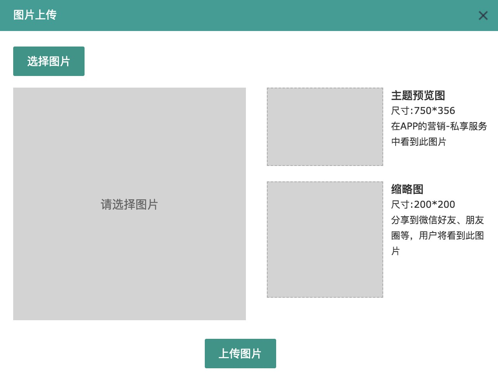

-----
title: 图片裁剪
category: JavaScript
date: 2018-08-08
tags: [JavaScript,crop]

------

图片裁剪在很多应用场景中出现,比如头像,缩略图,其主要需要实现三个功能:

1. 移动目标图片上裁剪框,预览区实时显示相应比例大小;
2. 裁剪出相应的尺寸大小的图片;
3. 实现图片上传到服务器

下面就来具体描述一下用原生js来实现图片裁剪的方法。

### 实时预览裁剪框图片

实时预览图片让我联想到很早以前仿写的商品放大镜功能

实现原理猜想:

> 1. 设置一个原图的预览容器;
> 2. 设置一个不同比例的实时预览容器;
> 3. 对图片进行缩放,利用相对位移达到图片在预览容器中显示的效果;

